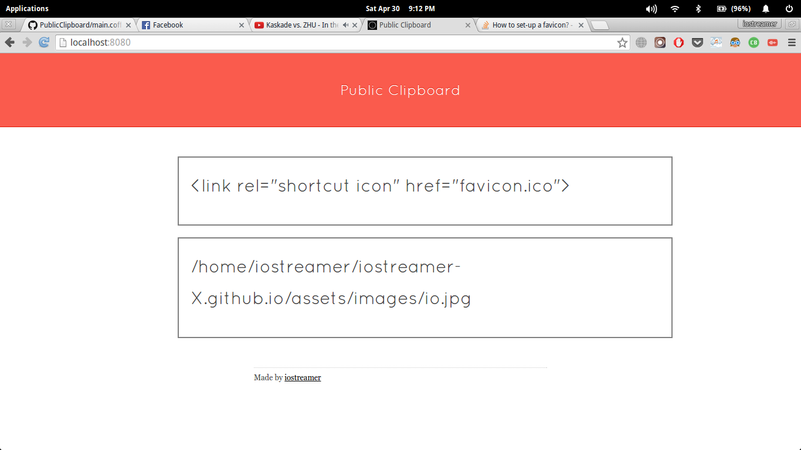
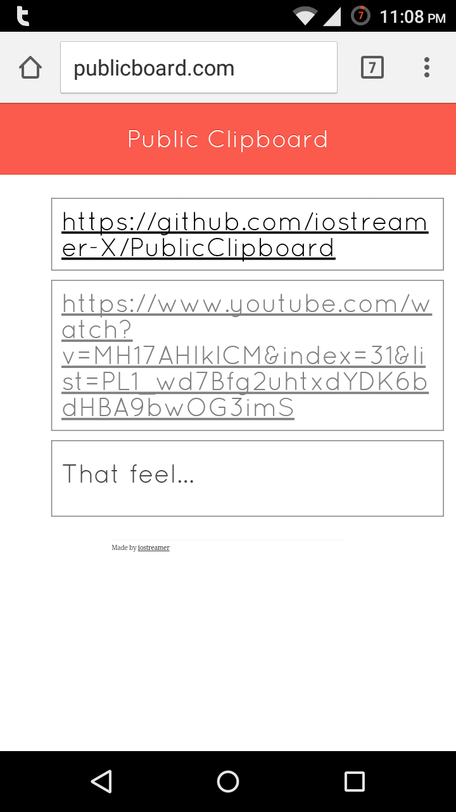

# PublicClipboard
Make your clipboard content accessible via HTTP to other devices on your network

# Dependencies
`sudo apt-get install xclip`

# Install
`npm install -g public_clipboard`

# Run
`public_clipboard`

The app runs on port 8080. To access the public clipboard visit `<your-ip:8080>`
You can also clear the content of your public clipboard by entering `clear`.
 
# Demo

# Remarks
publicboard.com is being resolved through my local dns server running on my laptop.
